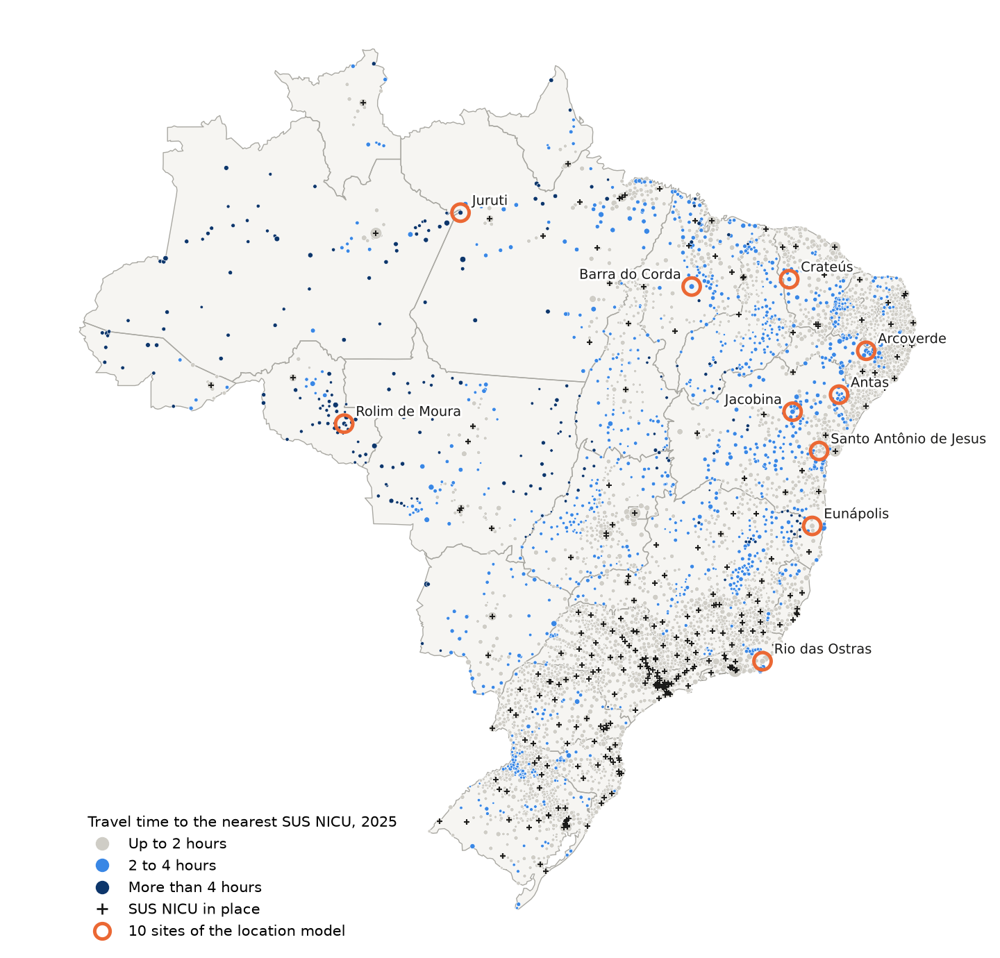
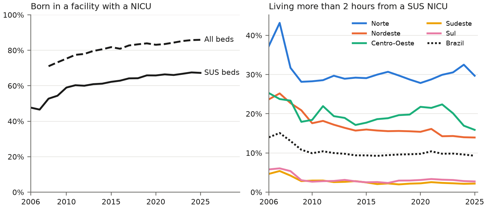

# Where should Brazil open its next neonatal ICUs?

[](https://github.com/paulianne-fontoura/nicu-access-brazil/actions)
[](LICENSE)

**The deliverable - [`report/note.pdf`](report/note.pdf), a seven-page technical note.**

> **Em português.** Onde o Brasil deveria abrir as próximas UTIs neonatais? O projeto
> mede, de 2006 a 2025, o acesso dos nascidos vivos de 500 a 1.499 g às UTIs
> neonatais do SUS, verifica se as unidades abertas no período foram para onde
> estavam os nascimentos fora de alcance e indica, com um modelo de cobertura
> máxima resolvido de forma exata, os municípios onde 5, 10 ou 20 novas unidades
> cobririam mais nascimentos. A parcela que mora a mais de duas horas de uma UTI
> neonatal SUS caiu de 14,0 % para 9,3 %, quase toda até 2010, e o Norte continua
> perto de 30 %. Dados abertos do DATASUS (SINASC, CNES) e do IBGE.

A newborn of 500 to 1,499 g depends on neonatal intensive care from the first
hours of life. Brazil added NICU beds over the last twenty years, yet some of
these births still happen hours away from one. This project asks the question a
planner faces. How did access change, did the new units go where births were out
of reach, and where would the next units bring the most births within reach?

Twenty years of open data, 56 million live births and 693,038 births at risk,
travel time on the IBGE bus and boat network, and an exact maximal covering
location model. Python and DuckDB, every number of the note written by the
pipeline. The project measures and ranks options under explicit assumptions, it
does not assess public policy.

## Results



**Access improved early, then stalled.** The share of births of 500 to 1,499 g
born in a facility with a SUS NICU rose from 47.7 % in 2006 to 67.3 % in 2025. The
share living more than two hours from one fell from 14.0 % to 9.9 % by 2010, then
barely moved, 9.3 % in 2025.



**The North did not follow.** 37.3 % of its births at risk lived more than two
hours from a SUS NICU in 2006, 28.3 % in 2010 and 29.7 % in 2025. It holds 10 % of
the births at risk and 32 % of those beyond two hours.

| Region | Births 500-1,499 g, 2025 | Born in a NICU facility, 2006 | 2025 | Over 2 hours away, 2006 | 2025 |
|---|---:|---:|---:|---:|---:|
| Norte | 3,128 | 46.4 % | 62.1 % | 37.3 % | 29.7 % |
| Nordeste | 8,158 | 44.3 % | 68.0 % | 23.7 % | 13.9 % |
| Sudeste | 12,775 | 55.3 % | 65.0 % | 4.7 % | 2.2 % |
| Sul | 4,397 | 31.5 % | 78.6 % | 5.8 % | 2.7 % |
| Centro-Oeste | 2,693 | 44.0 % | 63.1 % | 25.3 % | 15.9 % |
| **Brazil** | **31,151** | **47.7 %** | **67.3 %** | **14.0 %** | **9.3 %** |

**Most new units opened where access already existed.** SUS NICU beds went from
2,874 to 5,186. 112 municipalities opened their first unit, 34 of them more than
two hours from any unit in 2006. Held at their 2006 distribution, 2,423 of the
4,779 births then out of reach would be within reach of the 2025 units, while 307
fell out of reach where 25 municipalities lost all their SUS NICU beds. Of the
4.7-point fall, beds account for -7.1 points and the shift of births towards
regions farther from units for +2.4.

**Ten new units would reach a fifth of the uncovered births.** Over 2021-2025,
15,398 births at risk lived more than two hours from a SUS NICU. Ten units sited
in municipalities that already have 1,000 births a year would bring 3,010 of them
within reach (20 %), and a unit in every one of the 217 candidates no more than
9,907 (64 %). Arcoverde (PE) and Jacobina (BA) are chosen in at least four of the
five years taken alone and under straight-line distances. Only two of the ten
sites are in the North, which holds 31 % of the uncovered births, because a model
that counts births favours denser regions.

Figures from the run of 8 October 2026, 2025 preliminary.

## What this project shows

- **Prescriptive analysis** - a maximal covering location problem solved exactly
  as an integer program (SciPy, HiGHS), on five pooled years, then year by year,
  at three travel times and under straight-line distances, to tell solid sites
  from fragile ones.
- **Measurement choices made explicit** - six decision records in
  [docs/adr](docs/adr), from the risk definition (births under 500 g follow
  registration practice, not need) to the 2007-2008 change of CNES bed codes.
- **An exact decomposition** of the change in access into a beds effect and a
  births effect.
- **Robust ingestion** - PySUS mirror first, DATASUS FTP otherwise, resumed
  downloads, a manifest with the content hash of every file, mirror and origin
  compared. A Windows bug of PySUS found on the way was reported upstream
  ([AlertaDengue/PySUS#372](https://github.com/AlertaDengue/PySUS/issues/372)).
- **A note that cannot drift from the data** - every number, table and figure is
  written by `nicu report`, and the sentences that state a fact about the data
  are checked, so the report stops if new data contradicts the text.

## Data

| Source | Content | Years |
|---|---|---|
| SINASC (DATASUS) | Every live birth, with weight, municipality of residence, municipality and facility of birth | 2006-2024 final, 2025 preliminary |
| CNES, beds (DATASUS) | Beds per facility and type, SUS and non-SUS | December of each year (November in 2007) |
| IBGE, Ligações rodoviárias e hidroviárias | Minimum bus or boat travel time between municipalities | 2016 |
| IBGE, Arranjos populacionais | Municipalities forming one urban area | 2015 |
| IBGE, Localidades | One point per municipality, its seat (5,571) | 2022 |
| IBGE, Malhas | State boundaries, for the map | 2022 |

All sources are public. Births are de-identified microdata, only counts are
published here.

## Run it

```bash
uv sync                       # Python 3.12 and dependencies
uv run nicu analyze           # the three questions, from the versioned counts
uv run nicu report            # numbers, tables and figures of the note
uv run pytest -q
```

`data/processed` (counts) and `data/results` (one CSV per result table) are
versioned, so the analysis and the note can be rebuilt from a clone without the
raw files. The note compiles with `latexmk -pdf note.tex` in `report/`, and
continuous integration compiles it on every change (artefact `note`).

To start from the raw files:

```bash
uv run nicu ingest ibge       # transport network, arrangements, seats, states
uv run nicu ingest cnes       # beds, one month per year and state
uv run nicu ingest sinasc     # births, one file per year and state
uv run nicu status            # what is still missing
uv run nicu build             # counts of births at risk and NICU beds
```

The full ingestion writes about 1,080 files, 330 MB of parquet, and takes several
hours, most of them on the years only the FTP server holds. It can be stopped and
started again, recorded files are skipped. With `make` installed, `make ingest`,
`make build`, `make analyze`, `make report`, `make note` and `make test` run the
same commands.

## Limits

The transport network dates from 2016 and is applied to the whole period. Travel
times are those of scheduled public transport. A municipality is reduced to its
seat. SINASC records where a child was born, not where it was treated. Beds are
those declared in the register, without occupancy or staffing. Weight leaves out
preterm births of normal weight, so demand is a floor. The location model
assumes a unit serves every birth within the travel time and does not weigh
equity between regions.

## Author

Paulianne Fontoura. This project extends published work on ICU bed planning
(Health Environments Research & Design Journal, 2026) and on obstetric decision
support, to the scale of a country.

## License

Code under the MIT license. Data from DATASUS and IBGE, public and open.
