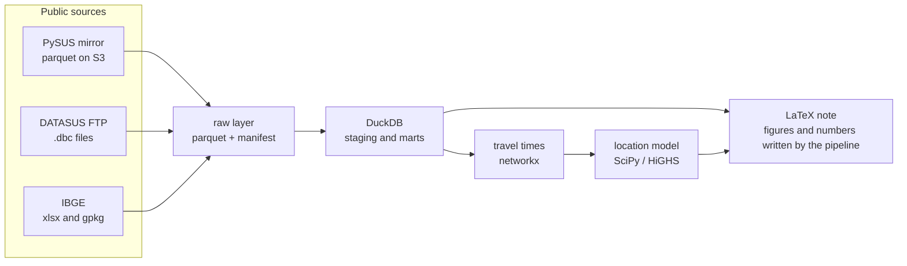

# Design

Status - accepted, 1 October 2026. Amended on 6 October 2026 (risk definition, sessions).
Changes go through an ADR.

## Question

Where should Brazil open its next neonatal intensive care units (NICUs) so that the
largest number of very-low-birth-weight births gain access within a reasonable travel
time, and does the answer hold from one year to the next?

A newborn of 500 to 1,499 g depends on intensive care in the first hours of life. Being
born in a hospital that has a NICU, or close to one, is the condition the rest of
the care builds on. Brazil added NICU beds over the period, but where they went
matters as much as how many there are. The project answers three questions, each
building on the previous one.

1. **How did access change from 2006 to 2025?** For births of 500 to 1,499 g, the share
   born in a facility with a NICU, the share whose municipality of residence is more
   than 90, 120 or 180 minutes from the nearest NICU, and the trip actually made
   between residence and birth, by region and state.
2. **Did the beds opened over the period go where uncovered births were?** Bed
   growth split between municipalities that already had a NICU and municipalities
   that opened their first one, and the share of uncovered births that these openings
   brought within reach.
3. **Where would 5, 10 or 20 new units cover the most uncovered births?** A maximal
   covering location model, solved on the last five years together (2021 to 2025),
   then on each year, at other travel times and under straight-line distances, to
   tell the solid choices from the fragile ones.

The project measures and ranks options under explicit assumptions. It does not
judge public policy, and the note says so.

## Data

| Source | Use | Coverage |
|---|---|---|
| SINASC, live births (DATASUS) | Demand, weight, residence, facility and municipality of birth | 2006-2024 final, 2025 preliminary |
| CNES, beds (DATASUS, group LT) | NICU beds per facility, SUS and non-SUS | December of each year, November in 2007 |
| IBGE, Ligações rodoviárias e hidroviárias 2016 | Bus and boat travel times between municipalities | 5,407 municipalities |
| IBGE, Arranjos populacionais (2nd ed.) | Municipalities forming one urban area | 294 arrangements, 953 municipalities |
| IBGE, Localidades 2022 | One point per municipality, its seat | 5,571 municipalities |

Twenty years is the longest series the sources allow. SINASC goes back to 1996,
but CNES starts in August 2005, so 2006 is the first year with beds.

## Decisions

| ADR | Decision |
|---|---|
| [0001](adr/0001-risk-definition.md) | A birth at risk is a birth of 500 to 1,499 g. Births under 500 g are counted apart, gestational age is a sensitivity check from 2011 only |
| [0002](adr/0002-travel-time.md) | Travel time on the IBGE bus and boat network, with links inside urban arrangements, straight-line distance as a check |
| [0003](adr/0003-bed-scope.md) | SUS NICU beds as the main measure, all NICU beds as a check from 2008, codes harmonised across the 2007-2008 change |
| [0004](adr/0004-ingestion.md) | PySUS mirror first, DATASUS FTP origin when the mirror is empty or the year preliminary, never an empty file |
| [0005](adr/0005-location-model.md) | Maximal covering location model solved exactly on the last five years together, candidates with 1,000 births a year, each choice checked year by year |

## Architecture

Python 3.12 with uv, typer command line `nicu`. The raw layer keeps every column
as text, typing happens in DuckDB. `nicu build` reduces the raw files to counts by
year, municipality and facility, small enough to be versioned, and the analysis
reads nothing else. CI runs lint and tests on synthetic data only,
no network.

## Sessions

1. Repository, design, ingestion with resume and source comparison.
2. Processed tables and the three questions (`nicu build`, `nicu analyze`).
3. Note in LaTeX, README, map, final CI.

The plan had five sessions. Questions 1 to 3 share the same tables and the same
network, so they were built together.

## Out of scope

Bed occupancy and staffing, transfers after birth (they would need hospital
admission records), private insurance coverage, costs, road routing. Each would
change the answer and is named as a limit in the note.

## Known limits

The 2016 transport network is applied to every year, ten years before and nine
after. A municipality is reduced to its seat, distances inside a municipality are
zero. Beds are read once a year. SINASC records where a child was born, not
where it was treated.
